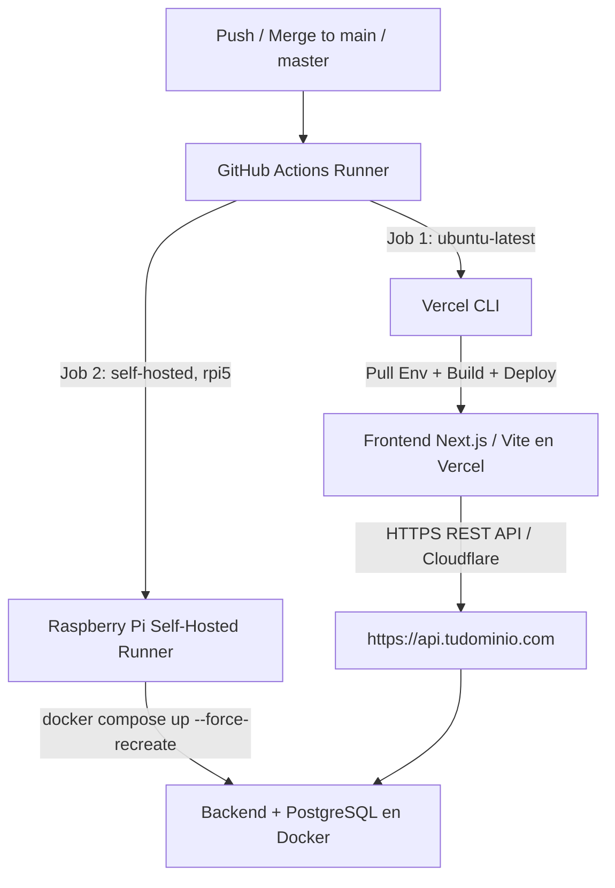

# Dual-Track CI/CD & Deployment Pipeline Runbook
> Production standard for automated monorepo deployment with **GitHub Actions**, **Vercel CLI** (Frontend), and **Raspberry Pi 5 Self-Hosted Runner** (Docker Compose Backend).

---

## 1. Pipeline Architecture

The monorepo uses a decoupled, dual-track deployment triggered simultaneously on pushes/merges to the production branch:



---

## 2. Complete GitHub Actions Workflow (`.github/workflows/deploy.yml`)

Create `.github/workflows/deploy.yml` at the repository root:

```yaml
name: Production Deployment Pipeline

on:
  push:
    branches:
      - main
      - master

concurrency:
  group: production-deploy
  cancel-in-progress: false

jobs:
  # ==========================================
  # JOB 1: FRONTEND DEPLOYMENT VIA VERCEL CLI
  # ==========================================
  deploy-frontend:
    name: Build & Deploy Frontend to Vercel
    runs-on: ubuntu-latest
    steps:
      - name: Checkout repository
        uses: actions/checkout@v4

      - name: Setup Node.js (Node 22 required for pnpm 10 / node:sqlite)
        uses: actions/setup-node@v4
        with:
          node-version: 22

      - name: Install pnpm & Vercel CLI
        run: npm install --global pnpm@latest vercel@latest

      - name: Pull Vercel Environment Information
        run: |
          vercel pull --yes --environment=production --token=${{ secrets.VERCEL_TOKEN }}
          if [ -f .vercel/.env.production.local ]; then
            cp .vercel/.env.production.local apps/web/.env.production.local 2>/dev/null || cp .vercel/.env.production.local frontend/.env.production.local 2>/dev/null || true
          fi
        env:
          VERCEL_ORG_ID: ${{ secrets.VERCEL_ORG_ID }}
          VERCEL_PROJECT_ID: ${{ secrets.VERCEL_PROJECT_ID }}

      - name: Build Project Artifacts
        run: vercel build --prod --token=${{ secrets.VERCEL_TOKEN }}
        env:
          VERCEL_ORG_ID: ${{ secrets.VERCEL_ORG_ID }}
          VERCEL_PROJECT_ID: ${{ secrets.VERCEL_PROJECT_ID }}
          NEXT_PUBLIC_API_URL: ${{ secrets.NEXT_PUBLIC_API_URL }}
          VITE_API_URL: ${{ secrets.VITE_API_URL || secrets.NEXT_PUBLIC_API_URL }}

      - name: Deploy Prebuilt Artifacts to Vercel
        run: vercel deploy --prebuilt --prod --token=${{ secrets.VERCEL_TOKEN }}
        env:
          VERCEL_ORG_ID: ${{ secrets.VERCEL_ORG_ID }}
          VERCEL_PROJECT_ID: ${{ secrets.VERCEL_PROJECT_ID }}
          NEXT_PUBLIC_API_URL: ${{ secrets.NEXT_PUBLIC_API_URL }}
          VITE_API_URL: ${{ secrets.VITE_API_URL || secrets.NEXT_PUBLIC_API_URL }}

  # ==========================================
  # JOB 2: BACKEND DEPLOYMENT ON RASPBERRY PI
  # ==========================================
  deploy-backend:
    name: Deploy Backend on Raspberry Pi 5
    runs-on: [self-hosted, linux, rpi5]
    steps:
      - name: Checkout repository
        uses: actions/checkout@v4

      - name: Restore server environment file (.env)
        run: |
          ENV_STORE="/home/github-runner/env-backups/${{ github.event.repository.name }}/.env"
          if [ -f .env ]; then
            echo "✅ .env already present in the runner workspace."
          elif [ -f "$ENV_STORE" ]; then
            echo "📋 Restoring .env from $ENV_STORE"
            cp "$ENV_STORE" .env
          else
            echo "❌ No .env found for this repository."
            echo "   Expected at: $ENV_STORE"
            echo "   Create it once on the server (see §5.2):"
            echo "     sudo install -d -o github-runner -g github-runner -m 700 $(dirname "$ENV_STORE")"
            echo "     sudo install -o github-runner -g github-runner -m 600 ./.env $ENV_STORE"
            exit 1
          fi
          chmod 600 .env

      - name: Build & Deploy Docker Containers with Force Recreate
        run: |
          docker compose -f docker-compose.prod.yml up -d --build --force-recreate --remove-orphans

      - name: Verify deployment (fails the job if unhealthy)
        run: |
          docker compose -f docker-compose.prod.yml ps
          echo "==> Waiting for every service to report healthy..."
          for i in $(seq 1 30); do
            UNHEALTHY=$(docker compose -f docker-compose.prod.yml ps \
              --format '{{.Name}} {{.Health}}' | awk '$2 != "" && $2 != "healthy"')
            [ -z "$UNHEALTHY" ] && break
            sleep 5
          done
          if [ -n "$UNHEALTHY" ]; then
            echo "❌ Services never became healthy:"; echo "$UNHEALTHY"
            docker compose -f docker-compose.prod.yml logs --tail=80
            exit 1
          fi
          echo "==> Smoke test against the health endpoint"
          set -a; . ./.env; set +a   # el shell del runner no tiene el .env cargado
          curl -fsS "http://localhost:${BACKEND_HOST_PORT:-3004}/health" \
            || { docker compose -f docker-compose.prod.yml logs --tail=80 backend; exit 1; }
          echo "✅ Deployment verified."

---

## 3. Vercel CLI Strategy & Monorepo Gotchas

### Why Vercel CLI instead of Native Git Integration?
- **Hobby Plan Limitation**: Vercel blocks native Git repository linking when a repository is **both private and owned by a GitHub Organization** (it demands an upgrade to the Pro plan).
- **Zero-Cost Solution**: Deploying through **Vercel CLI in GitHub Actions** using a personal access token compiles and uploads directly via API with full monorepo support without organization upgrade restrictions.

### Required GitHub Secrets (`Settings > Secrets and variables > Actions`)
| Secret | Description | Where to obtain |
| :--- | :--- | :--- |
| `VERCEL_TOKEN` | Vercel Personal Access Token | Vercel Dashboard > *Account Settings > Tokens* |
| `VERCEL_PROJECT_ID` | Specific Project ID | Vercel Project > *Settings > General* |
| `VERCEL_ORG_ID` | Team / Personal Account ID | Vercel Project > *Settings > General* (or User Settings) |
| `NEXT_PUBLIC_API_URL` | Public backend URL | e.g. `https://api.tudominio.com` |

---

## 4. Critical Deployment Pitfalls & Applied Solutions

### 1. `NEXT_PUBLIC_*` Build-Time Ingestion (Error 404 on Auth / Login)
- **Problem**: Next.js bakes `NEXT_PUBLIC_*` variables into the static browser bundle at **build time**. When building from monorepo root via Vercel CLI, if `NEXT_PUBLIC_API_URL` is omitted in the CI step, the client defaults to relative paths on the Vercel domain (`https://app.vercel.app/auth/login` -> 404 Not Found).
- **Solution**: Pass `NEXT_PUBLIC_API_URL` explicitly in the `env` blocks of both `vercel build` and `vercel deploy`, and copy `.vercel/.env.production.local` to `apps/web/.env.production.local`.

### 2. Monorepo Root Duplication (`apps/web/apps/web/package.json ENOENT`)
- **Problem**: `Error: ENOENT: no such file or directory, open '.../apps/web/apps/web/package.json'`.
- **Causa**: Vercel project already configured `Root Directory: apps/web`. Adding `working-directory: ./apps/web` in GitHub Actions causes the CLI to duplicate the path.
- **Solution**: Run all Vercel CLI commands strictly from the **monorepo root** without `working-directory`.

### 3. Node.js 22 & pnpm 10 Compatibility (`node:sqlite`)
- **Problem**: `spawn pnpm ENOENT` or `ERR_UNKNOWN_BUILTIN_MODULE: No such built-in module: node:sqlite`.
- **Causa**: pnpm v10+ uses the native `node:sqlite` built-in module, which requires Node.js v22.13+.
- **Solution**: Always configure `actions/setup-node@v4` with `node-version: 22`.

### 4. Production Database Seeder Execution
- **Problem**: In production images where `devDependencies` are pruned, `ts-node` is missing and `prisma/seed.ts` fails silently or crashes the entrypoint.
- **Solution**: 
  1. In `apps/api/Dockerfile` (build stage), compile TypeScript seeders:
     `RUN npx tsc prisma/seed.ts --outDir dist/prisma --target ES2022 --module CommonJS || true`
  2. In `entrypoint.sh`, execute compiled JS directly:
     `node dist/prisma/seed.js || node dist/seed.js || true`
  3. Ensure `ADMIN_USERNAME` and `ADMIN_PASSWORD` in `seed.ts` are read strictly from `process.env` (throw an error if not present, never fallback to known insecure defaults).

### 5. Multi-line YAML Heredoc Syntax Errors (`wanted 'EOF'`)
- **Problem**: `Invalid workflow file: warning: here-document delimited by end-of-file (wanted 'EOF')`.
- **Causa**: Indented Bash heredocs (`cat << 'EOF'`) inside YAML `run: |` blocks fail parsing because indentation clashes with YAML block boundaries.
- **Solution**: Avoid heredocs in YAML; use simple shell commands (`cp "$ENV_STORE" .env`, `echo ...`).

### 6. Container & State Refresh (`--force-recreate`)
- **Problem**: Code or `.env` changes on Raspberry Pi are not picked up if Docker thinks image layers haven't changed.
- **Solution**: Always deploy with:
  ```bash
  docker compose -f docker-compose.prod.yml up -d --build --force-recreate --remove-orphans
  ```

### 7. Dev and Prod Building to the Same Image Name
- **Problem**: Production comes up running the development image — dev server instead of the static/compiled server, or a container that answers nothing.
- **Causa**: Both compose files build to the same default image name (`<project>-backend`). Without `--build`, Compose reuses whatever image already carries that tag.
- **Solution**: recipe in `docker-compose-recipes.md` §4.3. Always deploy with `--build --force-recreate`.

### 8. Environment Variables Are Frozen at Container Creation
- **Problem**: `.env` is edited on the server, the container is restarted, and the old value is still in effect.
- **Causa**: see `database-lifecycle.md` §0 — a container's environment is frozen at creation time.
- **Solution**: Re-create the container: `docker compose -f docker-compose.prod.yml up -d --force-recreate <service>`. Confirm with `docker exec <container> printenv <VAR>`.

### 9. `.env` Is Never Updated by `git pull`
- **Problem**: A variable is changed in `.env.example`, merged and deployed — and production keeps the old value.
- **Causa**: `.env` is git-ignored, so it only exists on the server and no deploy ever rewrites it. Only the tracked `.env.example` moves.
- **Solution**: Any change to `.env.example` carries a manual step on the server: edit `.env`, re-create the container (§8), and copy the file back to the per-repository store (§5.2). Never let the workflow "fix" it by falling back to the template.

---

## 5. Self-Hosted Runner — Alcance, Entorno y Host Compartido

### 5.1 El runner vive en la organización, no en la cuenta personal

Cuando el runner está registrado **a nivel organización**, un repositorio que nace en la cuenta
personal **no lo ve**: el job queda en `Queued` indefinidamente y no hay mensaje de error.

- **Antes del primer deploy, el repositorio tiene que estar bajo la organización.** Si nació
  personal: *Settings → General → Danger Zone → Transfer ownership*.
- La organización debe habilitar el runner group para ese repositorio
  (*Org Settings → Actions → Runner groups*).
- Verificar el estado **antes** de mergear a la rama de producción (ver §7).

### 5.2 Un archivo de entorno por repositorio

El servidor guarda los `.env` productivos fuera del workspace (que `actions/checkout` limpia en
cada corrida). **Con más de un proyecto en el mismo host, un archivo único no alcanza:** el
primer repositorio se lo queda y el resto lee credenciales ajenas o pisa las suyas.

```
/home/github-runner/env-backups/
├── <repo-a>/.env      # 600, owner github-runner
├── <repo-b>/.env
└── <repo-c>/.env
```

Alta de un proyecto nuevo (una sola vez, en el servidor):

```bash
REPO=<nombre-del-repo>
sudo install -d -o github-runner -g github-runner -m 700 /home/github-runner/env-backups/$REPO
sudo install -o github-runner -g github-runner -m 600 \
  /home/<usuario>/Documents/$REPO/.env /home/github-runner/env-backups/$REPO/.env
ls -l /home/github-runner/env-backups/$REPO/.env
```

El workflow deriva la ruta de `${{ github.event.repository.name }}`, así que el YAML es idéntico
en todos los proyectos y no hay nada que editar por repo.

> **Migración desde el layout viejo** (un `.env` suelto en `env-backups/`): mover el archivo a su
> carpeta, desplegar una vez para confirmar, y recién ahí borrar el original.

### 5.3 Host compartido: reglas de convivencia

El servidor hospeda varios proyectos simultáneos, con contenedores de todos ellos.

| Prohibido | Por qué |
| :--- | :--- |
| `docker system prune` / `docker container prune` | Se lleva contenedores e imágenes de los otros proyectos |
| `docker compose down` sin `-f docker-compose.prod.yml` desde el directorio del proyecto | Actúa sobre lo que Compose crea que es "el proyecto actual" |
| Reusar puertos sin verificar | Colisión silenciosa con otro proyecto ya desplegado |

Antes de asignar los puertos de un proyecto nuevo:

```bash
docker ps --format 'table {{.Names}}\t{{.Ports}}'
```

### 5.4 Aislamiento y permisos

1. El runner aísla el workspace en `/home/github-runner/actions-runner/_work/<repo>/<repo>/`.
2. `chmod 600 .env` — solo el usuario del runner lee los secretos.
3. **No hacen falta secretos de SSH** (`RASPI_HOST`, `RASPI_SSH_KEY`, `RASPI_USER`): el runner ya
   corre dentro del servidor.

---

## 6. Catálogo de Diagnóstico (*modo `/inspecciona`*)

Comandos **exclusivamente de lectura**, para ejecutar en el servidor y responder "¿en qué estado
está producción realmente?" antes de proponer cualquier cambio. Ninguno modifica nada, así que se
pueden pegar sin riesgo — también en una terminal web sin SSH.

### 6.1 Inventario real del host

```bash
# TODOS los contenedores del host, incluidos los detenidos y los de otros proyectos.
# Nunca alcanza con `docker compose ps`: Compose sólo lista lo que reconoce como suyo
# (por labels, no por nombre), y deja invisibles a los huérfanos de versiones anteriores.
docker ps -a --format 'table {{.Names}}\t{{.Status}}\t{{.Image}}\t{{.Ports}}'
```

### 6.2 Salud y recursos del proyecto

```bash
docker compose -f docker-compose.prod.yml ps
docker inspect --format '{{.Name}} → {{.State.Health.Status}}' $(docker compose -f docker-compose.prod.yml ps -q)
docker stats --no-stream
df -h /
docker system df
```

### 6.3 Qué está corriendo de verdad

```bash
# Versión desplegada (ver §8), edad de la imagen y variables efectivas DENTRO del contenedor
# — que es lo único que manda, no lo que diga el .env del repo.
curl -fsS http://localhost:<puerto>/health
docker inspect --format '{{.Config.Image}} creado {{.Created}}' <contenedor>
docker exec <contenedor> printenv <VAR_1> <VAR_2>
```

### 6.4 Logs

```bash
docker compose -f docker-compose.prod.yml logs --tail=80
docker logs --tail=80 --since 30m <contenedor>
```

### 6.5 Reglas del modo

1. **Solo lectura.** Nada de `up`, `down`, `restart`, `rm`, `prune` ni escrituras en la base.
2. **Comandos de una sola línea**, pegables en una terminal web, con la salida esperada indicada.
3. Lo que aparezca para corregir **se lista y se espera aprobación**; una operación destructiva
   se propone junto con su respaldo previo, nunca sola.

---

## 7. Operación y Verificación con `gh` CLI

`gh` es el canal preferido: evita la web para los PRs y evita el servidor para saber si el deploy
salió bien. Todo esto corre desde la máquina de desarrollo.

```bash
# ¿El runner de la organización está disponible? (hacerlo ANTES de mergear)
gh api /orgs/<org>/actions/runners --jq '.runners[] | "\(.name)  \(.status)  busy=\(.busy)"'

# ¿Bajo qué cuenta está el repo? (si no es la organización, el runner no lo ve — §5.1)
gh repo view --json nameWithOwner,isPrivate --jq '.'

# Crear el PR hacia la rama de producción
gh pr create --base master --head develop --title "<título>" --body "<descripción>"

# Seguir el deploy en vivo, sin salir de la terminal
gh run watch

# Últimas corridas y resultado
gh run list --workflow=deploy.yml --limit 5

# Log del paso que falló (sin abrir el navegador)
gh run view --log-failed
```

**Regla:** un deploy no se da por bueno porque el job esté verde. `gh run watch` confirma que el
pipeline terminó; la verificación de §8 confirma que el código nuevo **llegó**.

---

## 8. Validación del Primer Despliegue (*sonda de versión*)

Un job en verde prueba que el pipeline corrió, no que el código nuevo esté sirviendo. El deploy
conserva el contenedor viejo hasta que el nuevo levanta, así que una imagen rota puede pasar
inadvertida durante semanas mientras la anterior sigue respondiendo.

**Procedimiento, una sola vez por proyecto:**

1. Agregar un marcador de versión **visible y sin ambigüedad** en los dos extremos: una ruta del
   backend que devuelva `{"version": 1}` y una etiqueta discreta en una pantalla del frontend.
2. Desplegar y comprobar los dos a simple vista.
3. Repetir con `version: 2` en un cambio que toque **backend y frontend a la vez**. Es la única
   forma de confirmar que el job levanta *todos* los contenedores y no sólo el que da nombre al
   job.
4. Dejar registrado en `docs/deployment.md` que esos marcadores son sondas de despliegue, con
   qué reemplazarlos y qué endpoint es el healthcheck real.

> El marcador puede quedarse: es inofensivo y sigue sirviendo para responder "¿qué versión está
> arriba?" desde el catálogo de diagnóstico (§6.3).
