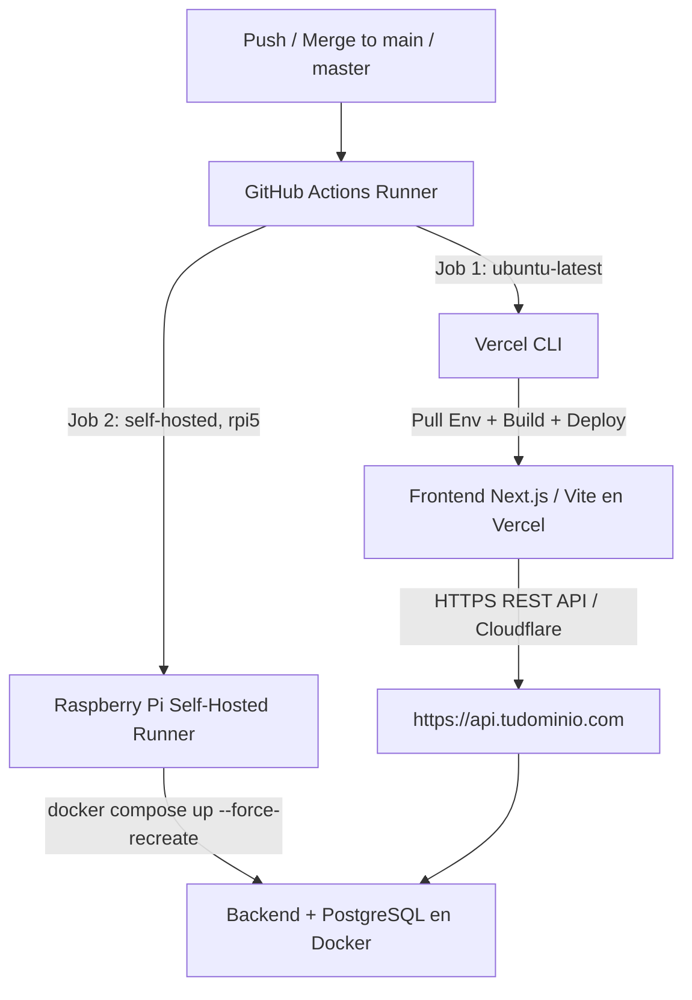

# Dual-Track CI/CD & Deployment Pipeline Runbook
> Production standard for automated monorepo deployment with **GitHub Actions**, **Vercel CLI** (Frontend), and **Raspberry Pi 5 Self-Hosted Runner** (Docker Compose Backend).

---

## 1. Pipeline Architecture

The monorepo uses a decoupled, dual-track deployment triggered simultaneously on pushes/merges to the production branch:



---

## 2. Complete GitHub Actions Workflow (`.github/workflows/deploy.yml`)

Create `.github/workflows/deploy.yml` at the repository root:

```yaml
name: Production Deployment Pipeline

on:
  push:
    branches:
      - main
      - master

concurrency:
  group: production-deploy
  cancel-in-progress: false

jobs:
  # ==========================================
  # JOB 1: FRONTEND DEPLOYMENT VIA VERCEL CLI
  # ==========================================
  deploy-frontend:
    name: Build & Deploy Frontend to Vercel
    runs-on: ubuntu-latest
    steps:
      - name: Checkout repository
        uses: actions/checkout@v4

      - name: Setup Node.js (Node 22 required for pnpm 10 / node:sqlite)
        uses: actions/setup-node@v4
        with:
          node-version: 22

      - name: Install pnpm & Vercel CLI
        run: npm install --global pnpm@latest vercel@latest

      - name: Pull Vercel Environment Information
        run: |
          vercel pull --yes --environment=production --token=${{ secrets.VERCEL_TOKEN }}
          if [ -f .vercel/.env.production.local ]; then
            cp .vercel/.env.production.local apps/web/.env.production.local 2>/dev/null || cp .vercel/.env.production.local frontend/.env.production.local 2>/dev/null || true
          fi
        env:
          VERCEL_ORG_ID: ${{ secrets.VERCEL_ORG_ID }}
          VERCEL_PROJECT_ID: ${{ secrets.VERCEL_PROJECT_ID }}

      - name: Build Project Artifacts
        run: vercel build --prod --token=${{ secrets.VERCEL_TOKEN }}
        env:
          VERCEL_ORG_ID: ${{ secrets.VERCEL_ORG_ID }}
          VERCEL_PROJECT_ID: ${{ secrets.VERCEL_PROJECT_ID }}
          NEXT_PUBLIC_API_URL: ${{ secrets.NEXT_PUBLIC_API_URL }}
          VITE_API_URL: ${{ secrets.VITE_API_URL || secrets.NEXT_PUBLIC_API_URL }}

      - name: Deploy Prebuilt Artifacts to Vercel
        run: vercel deploy --prebuilt --prod --token=${{ secrets.VERCEL_TOKEN }}
        env:
          VERCEL_ORG_ID: ${{ secrets.VERCEL_ORG_ID }}
          VERCEL_PROJECT_ID: ${{ secrets.VERCEL_PROJECT_ID }}
          NEXT_PUBLIC_API_URL: ${{ secrets.NEXT_PUBLIC_API_URL }}
          VITE_API_URL: ${{ secrets.VITE_API_URL || secrets.NEXT_PUBLIC_API_URL }}

  # ==========================================
  # JOB 2: BACKEND DEPLOYMENT ON RASPBERRY PI
  # ==========================================
  deploy-backend:
    name: Deploy Backend on Raspberry Pi 5
    runs-on: [self-hosted, linux, rpi5]
    steps:
      - name: Checkout repository
        uses: actions/checkout@v4

      - name: Preserve / Configure Server Environment (.env)
        run: |
          if [ -f .env ]; then
            echo "✅ Existing .env found in runner workspace."
          elif [ -f /home/github-runner/env-backups/.env ]; then
            echo "📋 Restoring .env from backup location..."
            cp /home/github-runner/env-backups/.env .env
          elif [ -f .env.example ]; then
            echo "🔧 Initializing .env from template .env.example..."
            cp .env.example .env
          fi
          chmod 600 .env 2>/dev/null || true

      - name: Build & Deploy Docker Containers with Force Recreate
        run: |
          docker compose -f docker-compose.prod.yml up -d --build --force-recreate --remove-orphans

      - name: Verify Running Containers
        run: |
          docker compose -f docker-compose.prod.yml ps
```

---

## 3. Vercel CLI Strategy & Monorepo Gotchas

### Why Vercel CLI instead of Native Git Integration?
- **Hobby Plan Limitation**: Vercel blocks native Git repository linking when a repository is **both private and owned by a GitHub Organization** (it demands an upgrade to the Pro plan).
- **Zero-Cost Solution**: Deploying through **Vercel CLI in GitHub Actions** using a personal access token compiles and uploads directly via API with full monorepo support without organization upgrade restrictions.

### Required GitHub Secrets (`Settings > Secrets and variables > Actions`)
| Secret | Description | Where to obtain |
| :--- | :--- | :--- |
| `VERCEL_TOKEN` | Vercel Personal Access Token | Vercel Dashboard > *Account Settings > Tokens* |
| `VERCEL_PROJECT_ID` | Specific Project ID | Vercel Project > *Settings > General* |
| `VERCEL_ORG_ID` | Team / Personal Account ID | Vercel Project > *Settings > General* (or User Settings) |
| `NEXT_PUBLIC_API_URL` | Public backend URL | e.g. `https://api.tudominio.com` |

---

## 4. Critical Deployment Pitfalls & Applied Solutions

### 1. `NEXT_PUBLIC_*` Build-Time Ingestion (Error 404 on Auth / Login)
- **Problem**: Next.js bakes `NEXT_PUBLIC_*` variables into the static browser bundle at **build time**. When building from monorepo root via Vercel CLI, if `NEXT_PUBLIC_API_URL` is omitted in the CI step, the client defaults to relative paths on the Vercel domain (`https://app.vercel.app/auth/login` -> 404 Not Found).
- **Solution**: Pass `NEXT_PUBLIC_API_URL` explicitly in the `env` blocks of both `vercel build` and `vercel deploy`, and copy `.vercel/.env.production.local` to `apps/web/.env.production.local`.

### 2. Monorepo Root Duplication (`apps/web/apps/web/package.json ENOENT`)
- **Problem**: `Error: ENOENT: no such file or directory, open '.../apps/web/apps/web/package.json'`.
- **Causa**: Vercel project already configured `Root Directory: apps/web`. Adding `working-directory: ./apps/web` in GitHub Actions causes the CLI to duplicate the path.
- **Solution**: Run all Vercel CLI commands strictly from the **monorepo root** without `working-directory`.

### 3. Node.js 22 & pnpm 10 Compatibility (`node:sqlite`)
- **Problem**: `spawn pnpm ENOENT` or `ERR_UNKNOWN_BUILTIN_MODULE: No such built-in module: node:sqlite`.
- **Causa**: pnpm v10+ uses the native `node:sqlite` built-in module, which requires Node.js v22.13+.
- **Solution**: Always configure `actions/setup-node@v4` with `node-version: 22`.

### 4. Production Database Seeder Execution
- **Problem**: In production images where `devDependencies` are pruned, `ts-node` is missing and `prisma/seed.ts` fails silently or crashes the entrypoint.
- **Solution**: 
  1. In `apps/api/Dockerfile` (build stage), compile TypeScript seeders:
     `RUN npx tsc prisma/seed.ts --outDir dist/prisma --target ES2022 --module CommonJS || true`
  2. In `entrypoint.sh`, execute compiled JS directly:
     `node dist/prisma/seed.js || node dist/seed.js || true`
  3. Ensure `ADMIN_USERNAME` and `ADMIN_PASSWORD` in `seed.ts` are read strictly from `process.env` (throw an error if not present, never fallback to known insecure defaults).

### 5. Multi-line YAML Heredoc Syntax Errors (`wanted 'EOF'`)
- **Problem**: `Invalid workflow file: warning: here-document delimited by end-of-file (wanted 'EOF')`.
- **Causa**: Indented Bash heredocs (`cat << 'EOF'`) inside YAML `run: |` blocks fail parsing because indentation clashes with YAML block boundaries.
- **Solution**: Avoid heredocs in YAML; use simple shell commands (`cp .env.example .env`, `echo ...`).

### 6. Container & State Refresh (`--force-recreate`)
- **Problem**: Code or `.env` changes on Raspberry Pi are not picked up if Docker thinks image layers haven't changed.
- **Solution**: Always deploy with:
  ```bash
  docker compose -f docker-compose.prod.yml up -d --build --force-recreate --remove-orphans
  ```

---

## 5. Raspberry Pi 5 Self-Hosted Runner Best Practices

1. **Workspace Isolation**: GitHub Self-Hosted Runners automatically isolate workspaces under `/home/github-runner/actions-runner/_work/<repo-name>/<repo-name>/`.
2. **Environment File Security**: Apply `chmod 600 .env` so only the runner user can read secrets.
3. **No SSH Secrets Required**: Using self-hosted runners eliminates the need for `RASPI_HOST`, `RASPI_SSH_KEY`, or `RASPI_USER` in GitHub Secrets.

---

## 6. Verification & Operational Commands

```bash
# View backend logs on Raspberry Pi:
docker logs -f [PROJECT_NAME]-backend-prod

# Check container status and health:
docker compose -f docker-compose.prod.yml ps

# Rebuild and recreate services manually:
docker compose -f docker-compose.prod.yml up -d --build --force-recreate

# Test backend connectivity via Cloudflare Tunnel:
curl -I https://api.tudominio.com/health
```
